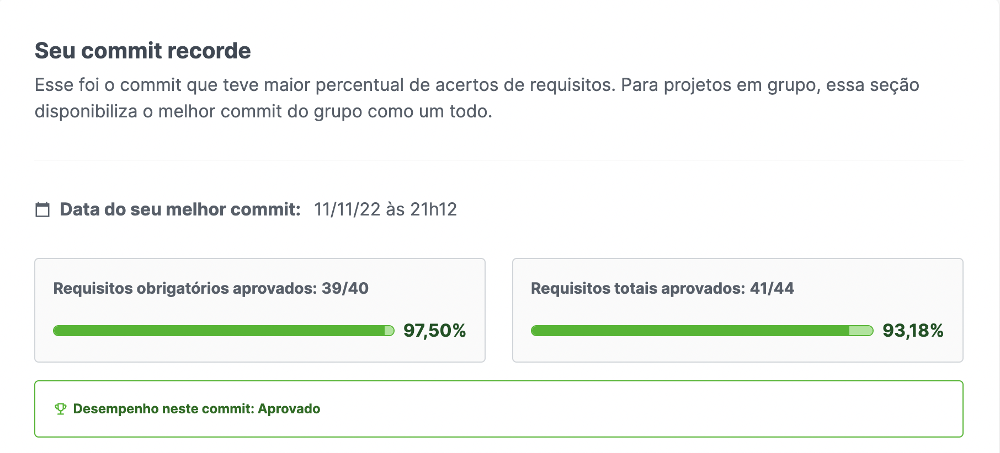

# Português 🇧🇷🇵🇹

<details>
  <summary>
    Saiba mais
  </summary>
  
  # Blogs Api
Projeto da [Trybe](https://www.betrybe.com/) - Bloco 31 - Aplicação Fullstack de uma empresa de delivery de bebidas.

<details>
  <summary><strong>🏆 Meu desempenho</strong></summary><br />

  
  
</details>

## 🚀 Tecnologias

> Este projeto foi desenvolvido com:

- React
- Context API
- LocalStorage
- React Router Dom
- React Testing Library
- Styled Components
- Node JS
- Express
- JSONWEBTOKEN
- md5
- cors
- mysql2
- chai
- sinon
- Nodemon
- MySQL
- Sequelize
- Docker
- Docker Compose
- Postman

## 📌 Habilidades

> Habilidades desenvolvidas:

- Desenvolver diferentes telas para o app de delivery.
- Desenvolver diferentes telas para diferentes tipos de usuários, cliente, vendendor e gerente.
- Desenvolver uma API RESTful de um CRUD (Create, Read, Update e Delete);
- Utilizar o ORM Sequelize para a leitura e escrita em um banco de dados SQL.
- Integrar frontend com backend a fim de logar usuários e autentica-los, cadastrar novos usuários, realizar
  compras, preparar as compras, envia-las, altera os status delas e exlcuir usuários.

## ‍💻 Softwares necessários

- Docker
- Docker Compose
- MySQL
- NPM || YARN

## ⬇️ Instalando dependências

```bash
npm install
docker run -it --name <nome_do_container> -e MYSQL_ROOT_PASSWORD=suasenha -d -p 3306:3306 mysql:tag
  ps: Caso não queria usar o banco de dados no docker crie um banco de dados com o nome 'delivery-app-dev'.
npm run dev:prestart # Instala dependências do front e do back
```

## ⚡ Executando o projeto

- Definindo as varáveis de ambiente em um arquivo .env;
- Criando o banco de dados e as tabelas com:

```bash
npm run db:reset # executa export NODE_ENV=development
                 # cd ./back-end
                 # npx sequelize-cli db:create
                 # npx sequelize-cli db:drop
                 # npx sequelize-cli db:migrate
                 # npx sequelize-cli db:seed:all
```

```bash
npm run dev # Sobe o front na porta 3000 e o back na 3001
```

### Disclaimer

<span style='color:red'>
  Todos os arquivos dos diretórios __tests__ e scripts foram desenvolvidos pela Trybe.
</span>

## Time de desenvolvimento

> Projeto em grupo:

<table>
    <tr>
      <td>
        
        <h4 align="center">Alê Rabelo</h4>
      </td>
      <td>
        
        <h4 align="center">André Macedo</h4>
      </td>
      <td>
        
        <h4 align="center">Amanda Zambelli</h4>
      </td>
      <td>
        
        <h4 align="center">Leonardo Gonçalves</h4>
      </td>
    </tr>
  </table>

## 💬 Contatos

<div align="center" style="display: inline_block">
  <a href="https://rabeloguedes.github.io" target="_blank">
    
  </a> 
  <a href="https://www.linkedin.com/in/al%C3%AA-emmanuel-rabelo-guedes/" target="_blank">
    
  </a> 
   <a href="mailto:rabeloguedes@proton.me">
     
  </a>
</div>

</details>

# English 🇺🇸🇬🇧

<details>
  <summary>
    More
  </summary>
  
  # Blogs Api
Project from [Trybe](https://www.betrybe.com/) - Block 31 - Beverage delivery company Fullstack application.

<details>
  <summary><strong>🏆 My accomplishment</strong></summary><br />

  
  

</details>

## 🚀 Technologies

> This project was developed with:

- React
- Context API
- LocalStorage
- React Router Dom
- React Testing Library
- Styled Components
- Node JS
- Express
- JSONWEBTOKEN
- md5
- cors
- mysql2
- chai
- sinon
- Nodemon
- MySQL
- Sequelize
- Docker
- Docker Compose
- Postman

## 📌 Skills

> Practiced skills:

- Developing an API RESTful CRUD (Create, Read, Update and Delete);
- Using the ORM Sequelize for reading and writing in a SQL database.
- Developing different screens for the delivery app.
- Developing different screens for different types of users, client, seller and manager.
- Integrating frontend with backend in order to log in users and authenticate them, register new users, make
  purchases, prepare purchases, send them, change their status and delete users.

## ‍💻 Required Softwares

- Docker
- Docker Compose
- MySQL
- NPM || YARN

## ⬇️ Install dependencies

```bash
npm install
docker run -it --name <container_name> -e MYSQL_ROOT_PASSWORD=yourpassword -d -p 3306:3306 mysql:tag
  ps: If you do not want to use the database in docker, create a database with the name 'delivery-app-dev'.
```

## ⚡ Running the project

- Defining the environment variables in a .env file;
- Creating the database and tables with:

```bash
npm run db:reset # runs export NODE_ENV=development
                 # cd ./back-end
                 # npx sequelize-cli db:create
                 # npx sequelize-cli db:drop
                 # npx sequelize-cli db:migrate
                 # npx sequelize-cli
```

### Disclaimer

<span style='color:red'>
  All files in the __tests__ and scripts directories were developed by Trybe.
</span>

## Squad

> Group project:

<table>
    <tr>
      <td>
        
        <h4 align="center">Alê Rabelo</h4>
      </td>
      <td>
        
        <h4 align="center">André Macedo</h4>
      </td>
      <td>
        
        <h4 align="center">Amanda Zambelli</h4>
      </td>
      <td>
        
        <h4 align="center">Leonardo Gonçalves</h4>
      </td>
    </tr>
  </table>

## 💬 Contact

<div align="center" style="display: inline_block">
  <a href="https://rabeloguedes.github.io" target="_blank">
    
  </a> 
  <a href="https://www.linkedin.com/in/al%C3%AA-emmanuel-rabelo-guedes/" target="_blank">
    
  </a> 
   <a href="mailto:rabeloguedes@proton.me">
     
  </a>
</div>

</details>

# Deutsch 🇩🇪

<details>
  <summary>
    Mehr
  </summary>
  
  # Blogs Api
Projekt von [Trybe](https://www.betrybe.com/) - Block 31 - Getränke-Lieferdienst Fullstack-Anwendung.

<details>
  <summary><strong>🏆 Meine Leistung</strong></summary><br />

  
  
</details>

## 🚀 Technologies

> Dieses Projekt wurde mit den entsprechenden Technologies hergestellt:

- React
- Context API
- LocalStorage
- React Router Dom
- React Testing Library
- Styled Components
- Node JS
- Express
- JSONWEBTOKEN
- md5
- cors
- mysql2
- chai
- sinon
- Nodemon
- MySQL
- Sequelize
- Docker
- Docker Compose
- Postman

## 📌 Fähigkeiten

> Ausgeübte Fähigkeiten:

- Entwickeln einer API RESTful CRUD (Create, Read, Update und Delete);
- Verwenden des ORM Sequelize zum Lesen und Schreiben in einer SQL-Datenbank.
- Entwicklung verschiedener Bildschirme für die Liefer-App.
- Entwicklung verschiedener Bildschirme für verschiedene Benutzertypen, Kunde, Verkäufer und Manager.
- Integration von Frontend mit Backend, um Benutzer anzumelden und zu authentifizieren, neue Benutzer zu registrieren,
  Einkäufe zu tätigen, Einkäufe vorzubereiten, sie zu senden, ihren Status zu ändern und Benutzer zu löschen.

## ‍💻 Benötigte Software

- Docker
- Docker Compose
- MySQL
- NPM || YARN

## ⬇️ Installieren dependencies

```bash
npm install
docker run -it --name <container_name> -e MYSQL_ROOT_PASSWORD=deinpasswort -d -p 3306:3306 mysql:tag
  ps: Wenn Sie die Datenbank nicht in Docker verwenden möchten, erstellen Sie eine Datenbank mit dem Namen 'delivery-app-dev'.
```

## ⚡ Projekt ausführen

- Definition der Umgebungsvariablen in einer .env-Datei;
- Erstellen der Datenbank und Tabellen mit:

```bash
npm run db:reset # runs export NODE_ENV=development
                 # cd ./back-end
                 # npx sequelize-cli db:create
                 # npx sequelize-cli db:drop
                 # npx sequelize-cli db:migrate
                 # npx sequelize-cli
```

### Disclaimer

<span style='color:red'>
  Alle Dateien in den Verzeichnissen __tests__ und scripts wurden von Trybe entwickelt.
</span>

## Entwickungsteam

> Gruppenprojekt:

  <table>
    <tr>
      <td>
        
        <h4 align="center">Alê Rabelo</h4>
      </td>
      <td>
        
        <h4 align="center">André Macedo</h4>
      </td>
      <td>
        
        <h4 align="center">Amanda Zambelli</h4>
      </td>
      <td>
        
        <h4 align="center">Leonardo Gonçalves</h4>
      </td>
    </tr>
  </table>

## 💬 Kontakt

<div align="center" style="display: inline_block">
  <a href="https://rabeloguedes.github.io" target="_blank">
    
  </a> 
  <a href="https://www.linkedin.com/in/al%C3%AA-emmanuel-rabelo-guedes/" target="_blank">
    
  </a> 
   <a href="mailto:rabeloguedes@proton.me">
     
  </a>
</div>

</details>
